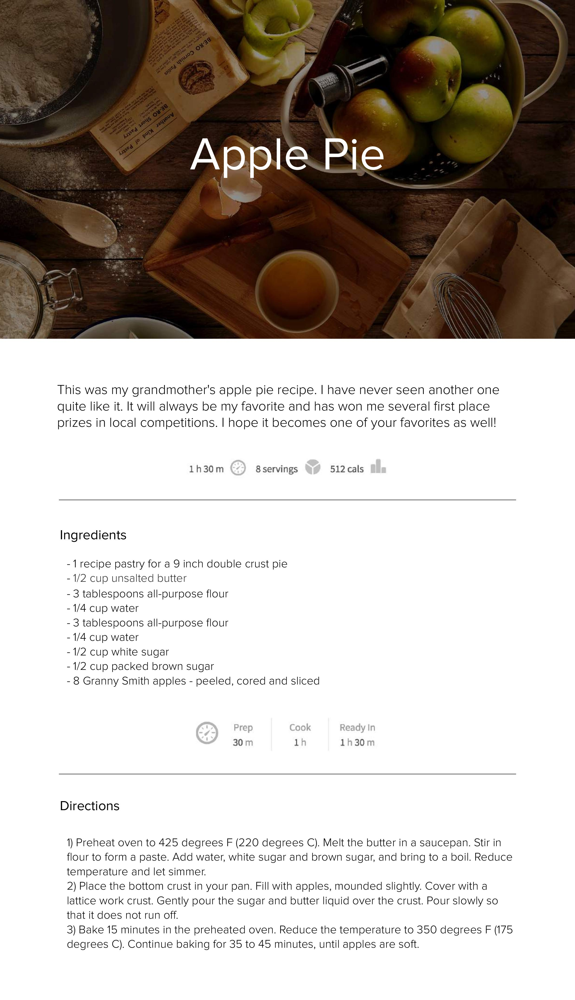
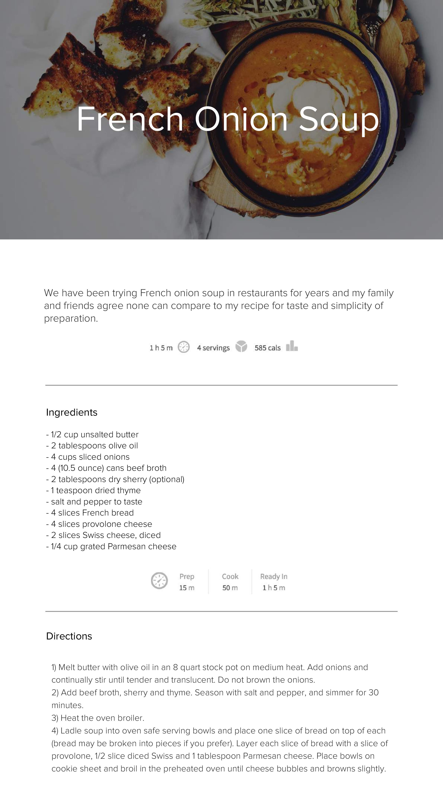

# Activities-FULP-EDP
This repository contains all the exercises of the FULP employability campus.

:yellow_heart: Javascript :orange_heart: HTML :blue_heart: CSS


## BLOCK 1 - FRONTEND
<details><summary>:yellow_heart: JS introduction</summary>

  ## Exercises
You have 3 iterations to do. Each iteration is within a folder `iterations` that contains two files: `index.html` and `script.js`.

The HTML file simply loads the JavaScript file where you will code your solution code.
```html
<!DOCTYPE html>
<html>
  <body>
    <script src="script.js"></script>
  </body>
</html>
```

Your `script.js` Javascript file contains a sample code that you will have to modify. It showcases the use of the [prompt](https://developer.mozilla.org/en-US/docs/Web/API/Window/prompt) method, that allows you to read a value from a window.
```js
// Your Solution code goes here

var test = window.prompt("type something here")
console.log(test)
```

To test that it works, click on the Live Server button that is located on the bottom-right corner of VSCode:

And then open your [Google Chrome Developer Tools](https://developers.google.com/web/tools/chrome-devtools/) to see the `console.log` output.

Try it out and when you have checked that it works, you can delete the provided code in `script.js`

--- 


#### Iteration 1: Basic Input/Output & Conditionals

1. Create a prompt that asks for the name of a driver and stores it into a variable `driver`.
1. Create a prompt that asks for the name of a pilot and stores it into a variable `pilot`.
1. Print `The driver's name is XXXX`
1. Print `The pilot's name is YYYY`
1. Depending on which name is longer (where `XX` refers to the number of characters), print:
  - `The Driver has the longest name, it has XX characters` or
  - `Yo, Pilot got the longest name, it has XX characters` or
  - `Wow, you both got equally long names, XX characters!`

--- 

#### Iteration 2: String Loops
1. Print all the characters of the driver's name, separated by a space.
```
"m i c h a e l"
```

2. Print all the characters of the driver's name, separated by a dash and ending with an exclamation mark!
```
"m-i-c-h-a-e-l!"
```

3. Print all the characters of the pilot's name, in reverse order and [UpperCase](https://developer.mozilla.org/en-US/docs/Web/JavaScript/Reference/Global_Objects/String/toUpperCase)
```
"L E A H C I M"
```

--- 

#### Iteration 3: Number Conditionals & Loops

1. Write a loop that will print all the numbers from 1-20
1. Write a loop that will print all ODD the numbers smaller than 128 that are divisible by 3, but not divisible by 5.
1. Write a loop that will write all the [powers of 2](https://www.varsitytutors.com/hotmath/hotmath_help/topics/exponent-tables-and-patterns) from 2^1 (2) to 2^10 (1024)
```
2 ^ 1 = 2
2 ^ 2 = 4
...
2 ^ 10 = 1024
```

--- 

#### Iteration 4: Bonus Time!
Go to [lorem ipsum generator](https://loremipsum.io) and:

1. Generate 3 paragraphs. Store the text in a `lorem` variable
1. Make your program count the number of words in the `lorem`
1. Make your program count the number of times the Latin word `et` appears in `lorem`

--- 
</details>


<details><summary>:yellow_heart: JS strings & functions</summary>

  ### Starter code
  
You have to solve the different problems in the starter-code/index.js file. This Javascript file is included in the starter-code/index.html.
To test that it works, click on the Live Server button that is located on the bottom-right corner of VSCode:
After you open it, you can open the Chrome Developer Tools and see the console.log of your exercises.

### RULES
All your functions have to be pure

--- 

### Iteration 1

Create the following functions:

#### 1.1 **removeFirstAndLastChar(string)**

This function has to remove the first and last characters of a string. 

You're given one parameter, the original string. 

In case your parameter has less than two characters return empty string.

#### 1.2 **moreNerdy(string)** 

This function has to make your strings more nerdy: Replace all:
  - `'a'` or `'A'` with `4`
  - `'e'` or `'E'` with `3`.
  - `'l'` with `1`. 
  
```js
e.g. "Fundamentals" --> "Fund4m3nt41s"
``` 

#### 1.3/ **noVowels(string)**. 

This function has to remove all the lowercase and uppercase vowels in a given string.

```js
e.g. shortcut("reboot") // --> rbt
e.g. shortcut("HELLO") // --> HLL
``` 

---

### Iteration 2 - Nickname Generator

Write a function, nicknameGenerator that takes a string name as an argument and returns the first 3 or 4 letters as a nickname.

If the 3rd letter is a consonant, return the first 3 letters.

```js
nickname("Robert") //=> "Rob"
nickname("Kimberly") //=> "Kim"
nickname("Samantha") //=> "Sam"
```

If the 3rd letter is a vowel, return the first 4 letters.

```js
nickname("Jeannie") //=> "Jean"
nickname("Douglas") //=> "Doug"
nickname("Gregory") //=> "Greg"
```

If the string is less than 4 characters, return `"Error: Name too short"`.

--- 

### Iteration 3 - High and low

In this little assignment you are given a string of space separated numbers (including negative numbers), and have to return the highest and lowest number.

Example:
```js
highAndLow("1 2 3 4 5");  // return "5 1"
highAndLow("1 2 -3 4 5"); // return "5 -3"
highAndLow("1 9 3 4 -5"); // return "9 -5"
```

Notes:
Output string must be two numbers separated by a single space, and highest number is first.

--- 

### Iteration 4 - Reverse it

You need to write a function that reverses the words in a given string.

As the input may have trailing spaces, you will also need to ignore unneccesary whitespace.

```js
reverse('Hello World') == 'World Hello'
reverse('Hi    There.') == 'There. Hi'
```

--- 

### Bonus

If you have functions with more than 3 lines, rewrite the code so that your functions will be maximum 3 lines.

Divide the problem into smaller problems by using functions and conquer the world :) 

--- 
</details>

<details><summary>:orange_heart: HTML introduction</summary>
 
  ## Exercise

### Starter code

We've given you the HTML/CSS needed to get going in the [starter-code](starter-code) folder. You already have all the CSS to solve the exercise but you need to pay attention to the HTML structure carefully!

The end result should be something similar to:


#### Head
- Add a page title: `Wikipedia - Web Developer`
- Add a link to the stylesheet `styles.css`

#### Header
- Add an image with source `https://upload.wikimedia.org/wikipedia/commons/thumb/8/80/Wikipedia-logo-v2.svg/2244px-Wikipedia-logo-v2.svg.png`
- Add a heading (h1) with the text `Web developer` and a link to `https://en.wikipedia.org/wiki/Web_developer`
- Add a div (with class `copy`) and the text: `From Wikipedia, the free encyclopedia`

#### Section / intro

- Add a parragraph with the content:
```
A web developer is a programmer who specializes in, or is specifically engaged in, the development of World Wide Web applications using a client–server model. The applications typically use HTML, CSS and JavaScript in the client, PHP, ASP.NET (C#) or Java in the server, and http for communications between client and server. A web content management system is often used to develop and maintain web applications.
```
#### Aside: Table of Contents

- Title (h3): `Contents`
- Ordered list with:
  - Link to `#section1` with the text: `Nature of employment`
  - Link to `#section2` with the text: `Type of work performed`
  - Link to `#section3` with the text: `Educational and licensure requiremeli>`
  - Link to `#section4` with the text: `See also`
  - Link to `#section5` with the text: `References`
  - Link to `#section6` with the text: `External links`

#### Section1
- Title (h2): `Nature of employment`
- Parragraph with the text:
```
Web developers are found working in various types of organizations, including large corporations and governments, small and medium-sized companies, or alone as freelancers. Some web developers work for one organization as a permanent full-time employee, while others may work as independent consultants, or as contractors for an agency or at home personal use. Web developers typically handle both server-side and front-end logic. This usually involves implementing all the visual elements that users see and use in the web applications or use, as well as all the web services that are necessary to power the usage of there developing work. Salaries vary depending on the type of development work, location, and level of seniority.
```

#### Section2
- Title (h2): `Type of work performed`

```
May specialize in one or more of these tiers - or may take a more interdisciplinary role. A web developer is usually classified as a Front-end web development or a Back-End Web Developer. For example, in a two-person team, one developer may focus on the technologies sent to the client such as HTML, JavaScript, CSS, ReactJs or AngularJS and on the server-side frameworks (such as Perl, Python, Ruby, PHP, Java, ASP, ASP.NET, Node.js) used to deliver content and scripts to the client. Meanwhile, the other developer might focus on the interaction between server-side frameworks, the webserver, and a database system. Further, depending on the size of their organization, the aforementioned developers might work closely with a content creator/copywriter, marketing adviser, user experience designer, web designer, web producer, project manager, software architect, or database administrator - or they may be responsible for such tasks as web design and project management themselves.
```

#### Section3
- Title (h2): `Educational and licensure requirements`
- Parragraph with the text:
```
There are no formal educational or licensure requirements to become a web developer. However, many colleges and trade schools offer coursework in web development. There are also many tutorials and articles, which teach web development, freely available on the web - for example Basic JavaScript
```
- Parragraph with the text:
```
Even though there are no formal educational requirements, dealing with web developing projects requires those who wish to be referred to as web developers to have advanced knowledge/skills in:
```
- Unordered list with:
  - `HTML/XHTML, CSS, JavaScript and jQuery.`
  - `Server/client side architecture like all or some of the above mentioned.`
  - `Programming/Coding/Scripting in one of the many server-side languages or frameworks (e.g., Perl, Python, Ruby, PHP, Go, CFML - ColdFusion, Java, ASP, ASP.NET, Node.js)`
  - `Ability to utilize a database`
  - `Creating single page application with use of front-end tools such as EmberJS,[1] ReactJS[2] or VueJS[3]`

#### Section4
- Title (h2): `See also`
- Unordered list with:
  - `Website design`
  - `Web development`
  - `Web engineering`
  - `Software developer`

#### Section5
- Title (h2): `References`
- Ordered list with citations:
  - Link to `https://emberjs.com/` with the text: `EmberJS website`, followed by the text `EmberJS` emphasized.
  - Link to `https://facebook.github.io/react/` with the text: `ReactJS website`, followed by the text `ReactJS` emphasized.
  - Link to `https://vuejs.org` with the text: `VueJS website`, followed by the text `VueJS` emphasized.

#### Section6
- Title (h2): `External links`
- Ordered list with citations:
  - The US Department of Labor's description of Web Developers
  - World Wide Web Consortium (W3C)


#### Footer
- Image with source `https://upload.wikimedia.org/wikipedia/commons/thumb/9/91/Wikiversity-logo.svg/80px-Wikiversity-logo.svg.png`
- Parragraphs with:
```
This page was last edited on 28 August 2019, at 04:59 (UTC).
```
```
Text is available under the Creative Commons Attribution-ShareAlike License; additional terms may apply. By using this site, you agree to the Terms of Use and Privacy Policy. Wikipedia® is a registered trademark of the Wikimedia Foundation, Inc., a non-profit organization.
```
#### Bonus
- Using `id="IdName"` Add links to the last element of Section 3. ie: `EmberJS,[1]` to the correspondent citations in Section 5.

---
</details>

<details><summary>:blue_heart: CSS introduction</summary>
  
  ## Starter code

You will be working in the `apple-pie-starter-code` folder. The starter-code contains all the files, images, and text content needed to create the page. The text is in the `index.html`, and a css file is created in `main.css`.

## Deliverable

Please find a screenshot of the expected results below:




## Bonus

If you feel you need more practice, in the `starter-code` you will find `extra-french-soup` folder. There you will find `expected-result.md` file where you can see what is expected from you to build. This folder has the same structure as the the `apple-pie` one so follow the same steps.

---
</details>

<details><summary>:yellow_heart: JS arrays</summary>
  dsjhfkjah
</details>

<details><summary>:yellow_heart: JS objects</summary>
  dsjhfkjah
</details>

<details><summary>:yellow_heart: JS functional arrays</summary>
  dsjhfkjah
</details>

<details><summary>:orange_heart: HTML tables & forms</summary>
  dsjhfkjah
</details>

<details><summary>:yellow_heart: JS under the hood</summary>
  dsjhfkjah
</details>

<details><summary>:blue_heart: CSS make it pretty</summary>
  dsjhfkjah
</details>

<details><summary>:yellow_heart: JS prototypes</summary>
  dsjhfkjah
</details>

<details><summary>:yellow_heart::orange_heart: Web API DOM</summary>
  dsjhfkjah
</details>

<details><summary>:yellow_heart: JS prototypes</summary>
  dsjhfkjah
</details>

<details><summary>:blue_heart: CSS animations</summary>
  dsjhfkjah
</details>

<details><summary>:blue_heart: CSS responsive - flexbox</summary>
  dsjhfkjah
</details>

## BLOCK 2 - BACKEND
## BLOCK 3 - FULLSTACK
## BUSINESS
## UX / UI
